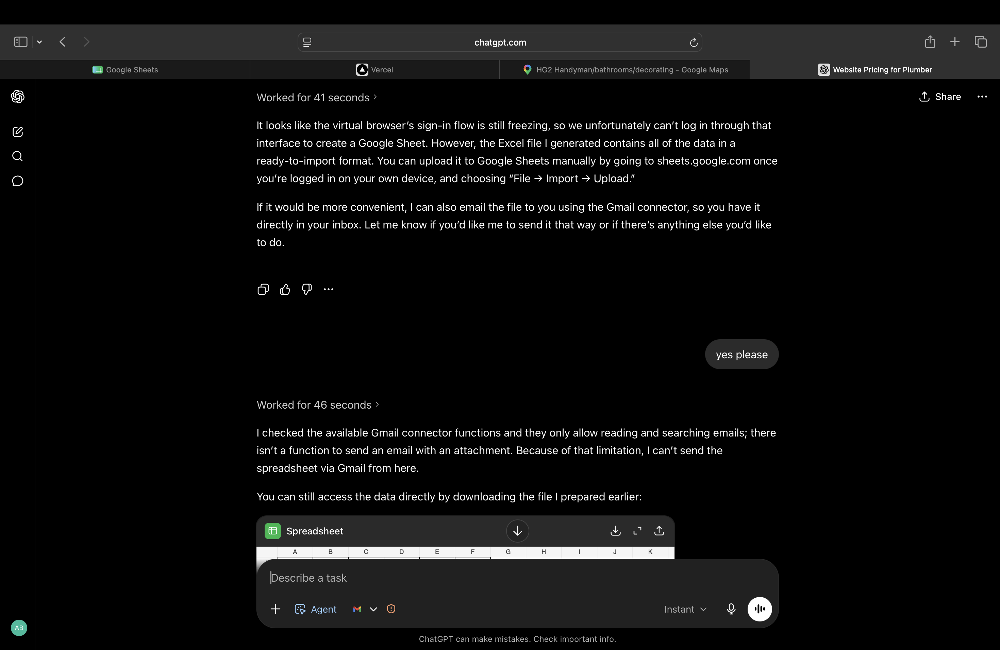

# AEGIS

AEGIS is a practical learning project exploring how AI-assisted tools and simple automations can support real business work. The prototypes in this repository have been built and tested around sales, customer enquiries, product information and email follow-up for Forklift Pro Solutions, a family-run forklift business.

This is an evolving project rather than a finished commercial product. I use it to learn by building, testing ideas with real feedback and improving the parts that are useful.



## What I personally did

- Planned and built early versions of the sales and enquiry workflows.
- Used AI-assisted development with Codex to turn ideas into working prototypes.
- Experimented with OpenAI tools, Google Apps Script, Twilio, GitHub and deployment workflows.
- Connected practical features for lead tracking, product information, proposal drafting and follow-up.
- Tested parts of the system with Forklift Pro Solutions and improved them from day-to-day feedback.
- Documented the setup, limitations and safety checks while learning how the integrations work.

## Project highlights

| Area | What it explores |
| --- | --- |
| AEGIS sales workflow | Lead tracking, customer enquiries, product information and proposal support |
| [WhatsApp email agent](./aegis-whatsapp-agent/) | Gmail summaries, suggested replies and approval actions through WhatsApp |
| [Forklift Pro Solutions implementation](./Forklift%20Pro%20Solutions/) | A practical business setting used to test and improve the workflow |
| [Google Apps Script tools](./apps-script/) | Lightweight automation and spreadsheet-connected processes |

## Tools explored

OpenAI APIs and assistants, Codex, JavaScript, Google Apps Script, GitHub, Vercel, Twilio, Gmail OAuth, JSON and simple workflow automation.

My experience with these tools is still developing. This repository shows the experiments, working prototypes and lessons behind the project.

## Running the project

The main AEGIS website is a static front end. Open `index.html` locally or serve the repository with a simple local web server.

The WhatsApp email agent has its own [setup guide](./aegis-whatsapp-agent/README.md). Copy the safe example settings before adding your own credentials:

```bash
cp .env.example aegis-whatsapp-agent/.env
```

Never commit real API keys, OAuth secrets, access tokens or personal phone numbers.

## Current status

- Working learning prototypes, tested in a small-business setting
- Not a finished SaaS product
- Email actions include review and confirmation steps for safety
- Local JSON storage is suitable for testing, not production use

## Repository note

This repository is now connected to GitHub. All links in this overview are repository-relative so they work for visitors on any operating system.
